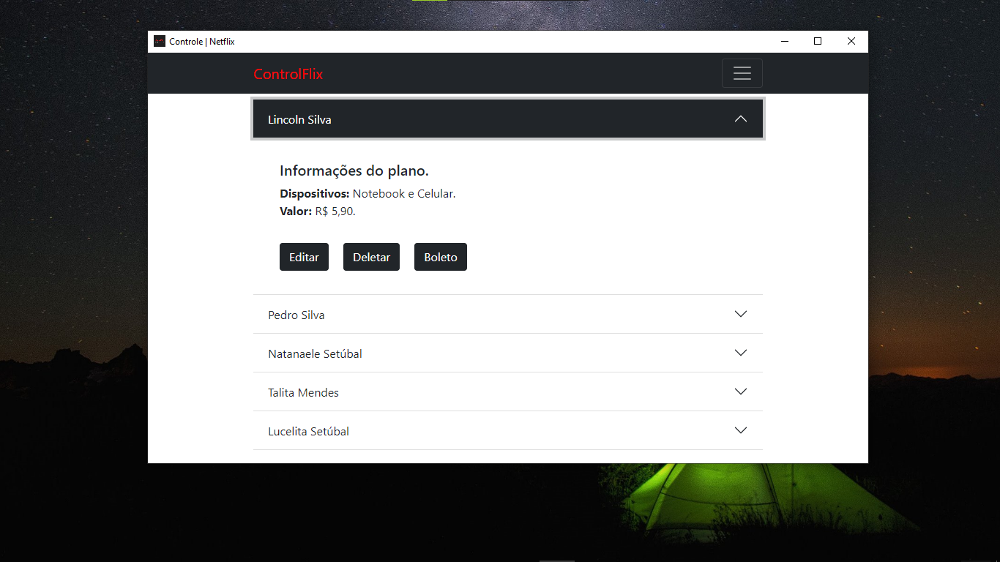

  <a href="#-tecnologias">Tecnologias</a>&nbsp;&nbsp;&nbsp;|&nbsp;&nbsp;&nbsp;
  <a href="#-projeto">Projeto</a>&nbsp;&nbsp;&nbsp;|&nbsp;&nbsp;&nbsp;

 

  

## 🚀 Tecnologias

Esse projeto foi desenvolvido com as seguintes tecnologias:

- Html
- Ejs
- Css
- Javascript
- Node
- Knex
- Sqlite3
- Electron
- Dotenv

## 💻 Projeto

A ControlFlix é uma aplicação que tem como objetivo colocar em prática as tecnologias e realizar o controle de pagamento e geração de boleto da netflix de forma fácil.

Feito com ♥ by Lincoln silva :wave:

- [Instagram](https://www.instagram.com/_lincolnsilva_/)
- [Github](https://github.com/LincolnSA)
- [Portfólio](https://lincolnsa.github.io/portfolio/)
- [devlincolnsilva@gmail.com](mailto:devlincolnsilva@gmail.com?subject=Oi%20lincoln)